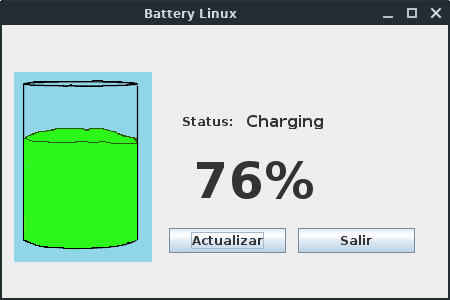

# LinuxBattery
* Acerca de  
* Preview
* Instalacion
* Funcionamiento    
## Acerca de:
 Esta Aplicacion fue hecha con el proposito de hacer pruebas para obtener datos de la terminal y que la aplicacion pueda interpretarlos y tambien debido a que en mi distribucion actual **Linux Lite** aun no me acostumbro a buscar la informacion de la bateria por lo que opte por diseñar una aplicacion que me sea mas comoda.  

## Preview 
   
  
Preview: 14-enero-2020  
  
   
  
Preview: 4-febrero-2020  
  
## Instalacion
Puede optar por la opcion de descargar este repositorio con el boton o introducir en la terminal el comando que esta a continuacion...  

```Bash
$ git clone https://github.com/JonnyJaccob/LinuxBattery.git
```
Primero hay que hablar que la aplicacion usa los comandos de acpi por lo que debera tenerlo instalado, puede usar el codigo de linux a continuacion:
```Bash
$ sudo apt-get install acpi
```
o puede buscar el comando para instalarlo en su distribucion. 
Para ejecutar el programa puede utilizar este comando en la terminal situada en el repositorio:
```Bash
$ java -jar LinuxBattery.jar
```
## Funcionamiento
Pulse **Estado** para obtener el registro e informacion completa de la bateria.  
  
**LinuxBattery.desktop** puede utilizarse como plantilla para crear el lanzador para usarse de acceso directo en el escritorio.
  
*Proximamente nuevas funciones*